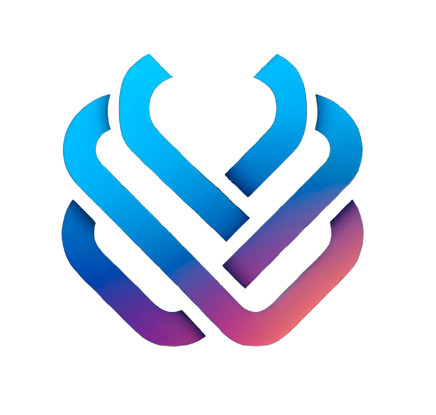

  

<h1 align="center">Relative</h1>

  A full-stack technology company building intelligent software, scalable automation, and digital ecosystems for creators and businesses.

---

## Overview

Relative is a technology-driven company focused on creating high-impact, high-standard tools across software, automation, and digital services. Our work supports entrepreneurs, companies, and creative professionals through custom platforms, AI-powered systems, and purpose-driven communities.

We design and develop:

- Modular and custom CRMs
- Business process automations
- Developer tools and AI-enhanced systems
- Scalable backends and web applications
- Internal platforms for training, coordination, and productivity

---

## Active Divisions

| Developer Studio | Edition Studio |
|------------------|----------------|
| A professional developer community working on open-source, infrastructure tools, automation, and internal systems. | A creative hub for video editors and digital artists, offering resources, job connections, and production workflow support. |

Each division operates with autonomy, high standards, and an expectation for quality, reliability, and innovation.

---

## Public Projects

Our repositories reflect the tools, systems, and products we actively use or develop internally. All projects follow a high-quality standard in terms of structure, performance, and documentation.

Current public release:

- **Relative-Dev-bot**  
  A Discord-based productivity assistant built for developer and editor communities. Includes AI-based features, project utilities, and integrated services.  

**Technologies Used:**  

  
  
  

More projects will be published progressively under the [Repositories](https://github.com/Relative?tab=repositories) section.

---

## Contact

- Website: [https://relative.gg](https://relative.gg)
- Discord: [Join our communities](https://discord.gg/relative)  
  *(Developer Studio & Edition Studio only)*
- Jobs opening: Soon.
- Email: [contact@relative.gg](mailto:contact@relative.gg)

---

## Collaboration

Relative operates under high standards of execution and professionalism. We are open to partnerships and contributors who align with our philosophy: clarity in thinking, precision in execution, and purpose in product design.

If you are interested in collaborating, contributing, or integrating your tools with our ecosystem, please get in touch.

---

  © Relative — All rights reserved.

